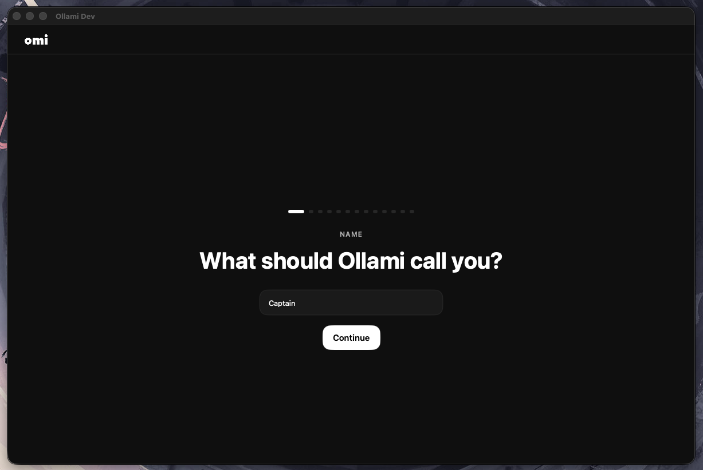

# Ollami



Local-first macOS AI assistant. No telemetry, no cloud, no third-party AI.
Everything runs on your Mac via Ollama, faster-whisper, and SQLite.

Fork of [Omi](https://github.com/BasedHardware/omi) with all cloud dependencies removed.

---

## What it is

Ollami captures your conversations, transcribes them in real-time using faster-whisper on Apple Silicon, generates summaries and action items, and gives you an AI chat that remembers everything — powered entirely by local models.

```
macOS Swift App
      │
      ▼
Local Python FastAPI  (localhost:8080)
      │
      ├── faster-whisper    — speech-to-text (Apple Silicon optimised)
      ├── Ollama            — LLM for chat, summaries, action items, agent
      ├── SQLite            — conversation + memory storage
      └── Chroma            — vector search (local embeddings via Ollama)
```

All data lives at `~/.ollami/` — nothing leaves your machine.

---

## Prerequisites

| Tool | Version | Install |
|------|---------|---------|
| macOS | 14+ (Sonoma) | — |
| Xcode | 15+ | App Store |
| Ollama | latest | `brew install ollama` |
| Python | 3.11+ | `brew install python@3.11` |

---

## Quick start

```bash
git clone https://github.com/SpencerSmithSite/Ollami.git
cd Ollami
```

**Step 1 — Build the desktop app**

```bash
cd desktop
OMI_APP_NAME=Ollami ./run.sh
```

This compiles the Swift app and installs it to `/Applications/Ollami.app`. Only needed once (or after Swift code changes).

**Step 2 — Launch everything**

```bash
cd ..
bash scripts/start.sh
```

`start.sh` handles the rest automatically:

1. Checks that Ollama and Python 3.11+ are installed
2. Starts Ollama if it isn't already running
3. Pulls `llama3.2` and `nomic-embed-text` if missing
4. Creates a Python virtualenv in `backend/.venv` and installs dependencies (first run only, ~2 min)
5. Starts the FastAPI backend on `http://localhost:8080`
6. Opens `/Applications/Ollami.app`

Logs are written to `/tmp/ollami-backend.log` and `/tmp/ollami-ollama.log`.

---

## Manual backend setup

If you prefer to run the backend yourself without `start.sh`:

```bash
cd backend

# Create a virtual environment
python3.11 -m venv .venv
source .venv/bin/activate

# Install dependencies
pip install -r requirements.txt

# (Optional) copy and edit the config
cp .env.example .env.local

# Start the server
uvicorn main:app --host 127.0.0.1 --port 8080
```

The backend requires Ollama to already be running (`ollama serve`).

---

## Configuration

Copy `backend/.env.example` to `backend/.env.local` and uncomment lines to override defaults.

| Variable | Default | Description |
|----------|---------|-------------|
| `OLLAMA_BASE_URL` | `http://localhost:11434/v1` | Ollama API endpoint |
| `OLLAMA_CHAT_MODEL` | `llama3.2` | Model for chat, summaries, agent |
| `OLLAMA_EMBED_MODEL` | `nomic-embed-text` | Model for vector embeddings |
| `WHISPER_MODEL_SIZE` | `small` | `tiny` / `base` / `small` / `medium` / `large-v3` |
| `TTS_VOICE` | `Samantha` | macOS voice (`say -v ?` lists all options) |
| `TTS_RATE` | `175` | Speaking rate in words per minute |
| `DB_PATH` | `~/.ollami/ollami.db` | SQLite database path |
| `CHROMA_PATH` | `~/.ollami/data/chroma` | Chroma vector store path |
| `STORAGE_PATH` | `~/.ollami/data/files` | Uploaded file storage |

The **Settings → Ollami** panel in the app lets you change the Ollama URL, active model, Whisper model size, backend URL, and webhook plugins without editing files.

---

## API overview

The backend exposes these routes at `http://localhost:8080`:

| Method | Path | Description |
|--------|------|-------------|
| `GET` | `/` | Health check |
| `WS` | `/v1/listen` | Real-time audio transcription (WebSocket) |
| `GET/POST/DELETE` | `/v1/conversations` | Conversation CRUD + export |
| `GET/POST/DELETE` | `/v1/memories` | Memory CRUD |
| `POST` | `/v1/memories/search` | Semantic memory search |
| `GET/POST/DELETE` | `/v1/chat/sessions` | Chat session management |
| `POST` | `/v1/chat/sessions/{id}/messages` | Send message (SSE streaming) |
| `POST` | `/v1/agent/run` | Ollama tool-calling agent |
| `GET` | `/v1/tts/voices` | List available macOS voices |
| `POST` | `/v1/tts/synthesize` | Text-to-speech → WAV |
| `GET/POST/DELETE` | `/v1/plugins` | Webhook plugin management |
| `GET/POST/DELETE` | `/v1/files` | File upload/download |

---

## What was removed from upstream Omi

- **Analytics** — Mixpanel, PostHog, Heap, Sentry, LangSmith, Datadog
- **Cloud auth** — Firebase OAuth → local UUID token at `~/.ollami/token`
- **Cloud AI** — OpenAI, Anthropic, Deepgram, ElevenLabs → local equivalents
- **Payments** — Stripe, subscription plans, upgrade prompts
- **Remote storage** — GCS → `~/.ollami/data/`
- **Mobile app** — iOS/Android Flutter app (macOS-only fork)
- **Firmware** — Omi wearable and Omi Glasses firmware
- **Cloud infrastructure** — Modal serverless, Firestore, Pinecone, Typesense, Twilio

---

## Roadmap

All phases complete.

- **Phase 1** — Strip telemetry and cloud from Swift app ✅
- **Phase 2** — Local Python backend (SQLite, faster-whisper, Ollama, Chroma) ✅
- **Phase 3** — Plugin webhook support ✅
- **Phase 4** — Benchmarks, export/import, launcher, tool-calling agent, local TTS ✅

See [`TODO.md`](TODO.md) for the full task list.

---

## License

MIT — same as upstream Omi.
